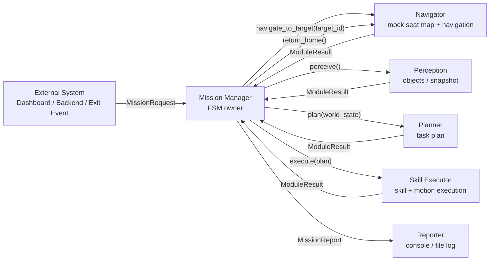
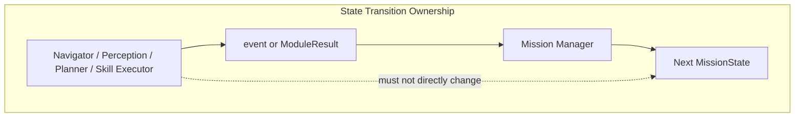
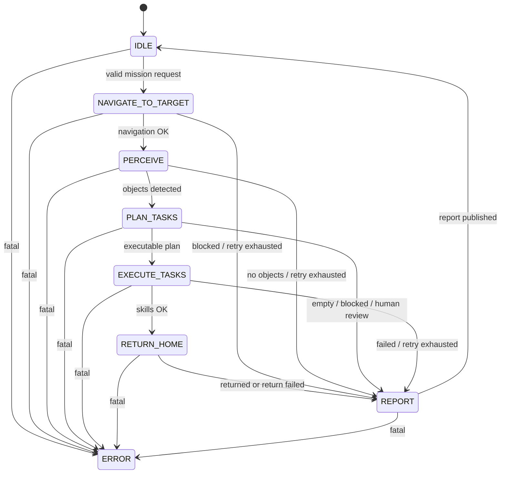
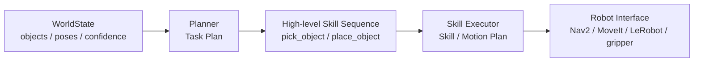

# cleany_mission_manager

Mission Manager FSM과 mission lifecycle을 담당하는 ROS 2 패키지.

## Goal

Mission Manager는 퇴실 좌석 정리 mission의 전체 흐름을 FSM으로 관리한다.

Mission Manager는 외부 요청을 받아 목표 위치로 이동하고, perception, planner, skill executor를 순서대로 호출하며, 각 모듈의 결과를 바탕으로 다음 상태를 결정한다.

다른 모듈은 event 또는 result를 반환할 수 있지만, Mission Manager의 상태를 직접 변경하지 않는다. FSM 상태 전이 권한은 Mission Manager에만 있다.

Mission Manager가 직접 책임지지 않는 것:

- 퇴실 여부 자체 판단
- 객체 탐지 모델 실행
- task plan 생성
- skill 내부 로봇 제어
- low-level safety 계산

MVP에서는 Safety Supervisor 또는 Safety Guardrail을 독립 컴포넌트로 두지 않는다. 각 모듈이 자기 책임 범위의 기본 safety check를 수행하고, Mission Manager는 공통 result를 해석해 상태를 전이한다.

## Architecture Overview





## Mission Scenario

MVP mission scenario는 실제 제품 흐름을 유지하되, navigation과 skill execution은 mock으로 시작한다.

1. 외부 시스템이 퇴실 좌석 정리 mission을 요청한다.
2. Mission Manager가 mission request를 받고 FSM을 시작한다.
3. Mission Manager가 Navigator에 목표 좌석으로 이동을 요청한다.
4. MVP에서는 Navigator가 `target_id`를 내부 mock seat map으로 pose에 매핑하고, 이동 성공을 mock으로 반환한다.
5. 목표 좌석에 도착한 뒤 Perception을 호출해 좌석 위 물체 목록을 받는다.
6. Planner가 물체 목록을 바탕으로 task와 skill sequence를 생성한다.
7. Skill Executor가 skill sequence를 실행하고 결과를 반환한다.
8. Mission Manager가 Navigator에 home 복귀를 요청한다.
9. MVP에서는 home 복귀도 mock으로 성공 처리한다.
10. Mission Manager가 결과를 report하고 `IDLE`로 돌아간다.

MVP에서는 `SeatMap` 또는 `TargetResolver`를 별도 모듈로 두지 않는다. `seat_id -> target_pose` 변환은 Navigator 내부 책임으로 둔다. 좌석/공간 map 로직이 커지면 이후 별도 `SeatMap` 또는 `TargetResolver`로 분리한다.

## FSM States

초기 MVP FSM은 다음 8개 상태로 시작한다.



## State Responsibilities

### IDLE

- mission request를 기다린다.
- mission request가 들어오면 기본 유효성을 확인한다.
- 유효한 요청이면 `NAVIGATE_TO_TARGET`으로 전이한다.

### NAVIGATE_TO_TARGET

- Navigator에 목표 좌석 이동을 요청한다.
- Mission Manager는 `target_pose`를 직접 계산하지 않는다.
- MVP에서는 Navigator가 `target_id` 또는 `seat_id`를 내부 mock seat map으로 해석한다.
- 이동 성공 시 `PERCEIVE`로 전이한다.
- 이동 실패 시 실패 결과에 따라 `REPORT` 또는 `ERROR`로 전이한다.

### PERCEIVE

- Perception을 호출해 좌석 위 물체 목록을 받는다.
- PerceptionResult를 해석해 다음 상태를 결정한다.
- 인식 가능한 물체가 있으면 `PLAN_TASKS`로 전이한다.
- 인식 실패 또는 물체 없음은 결과에 따라 재시도, `REPORT`, `ERROR` 중 하나로 처리한다.

### PLAN_TASKS

- Planner에 world state를 전달하고 task/skill sequence를 요청한다.
- 실행 가능한 task가 있으면 `EXECUTE_TASKS`로 전이한다.
- 모든 task가 `skip`이거나 `human_review`가 필요하면 `REPORT`로 전이한다.

### EXECUTE_TASKS

- Skill Executor에 skill sequence 실행을 요청한다.
- Skill Executor의 result를 해석해 다음 상태를 결정한다.
- 성공하면 `RETURN_HOME`으로 전이한다.
- retry 가능한 실패는 재시도한다.
- fatal 실패는 `ERROR`로 전이한다.

### RETURN_HOME

- Navigator에 home 복귀를 요청한다.
- MVP에서는 home 복귀도 mock으로 성공 처리할 수 있다.
- 복귀 성공 또는 복귀 실패 보고 후 `REPORT`로 전이한다.

### REPORT

- mission 결과를 기록한다.
- 성공/실패, failure code, 처리한 task를 report한다.
- report 완료 후 `IDLE`로 돌아간다.

### ERROR

- mission을 중단한다.
- fatal failure를 기록한다.
- reset 또는 운영자 개입을 기다린다.

## Inputs and Outputs

### MissionRequest

MVP mission request는 좌석 정리 작업을 시작하기 위한 최소 정보만 포함한다.

```text
mission_id
mission_type
target_id
requested_by
```

- `mission_id`: mission 식별자
- `mission_type`: 예: `clean_seat`
- `target_id`: 예: `seat_A_12`
- `requested_by`: 예: `dashboard`, `backend`, `exit_event`, `manual`

MVP에서는 Mission Manager가 `target_pose`를 직접 받지 않는다. Navigator가 `target_id`를 내부적으로 pose에 매핑한다.

나중에 필요하면 `target_pose`, `home_pose`, `priority`, `deadline` 등을 추가한다.

### ModuleResult

Mission Manager가 호출하는 모듈은 공통 result envelope를 반환한다. Mission Manager는 이 공통 형식을 보고 상태 전이, retry, report, error를 결정한다.

```text
ok
status
failure_code
retryable
message
data
```

- `ok`: 정상 처리 여부
- `status`: `OK`, `BLOCKED`, `FAILED`, `FATAL` 중 하나
- `failure_code`: 실패 원인 코드. 성공 시 `None`
- `retryable`: 같은 상태에서 재시도 가능한지 여부
- `message`: 사람이 읽을 수 있는 짧은 설명
- `data`: 모듈별 결과 payload

`status` 의미:

```text
OK       정상 처리됨. 다음 상태로 전이 가능
BLOCKED  정책/조건상 실행하지 않음. 보통 REPORT로 전이
FAILED   실행했지만 실패함. retryable이면 재시도 가능
FATAL    mission을 계속 진행하면 안 됨. ERROR로 전이
```

모듈별 `data` 예시:

```text
NavigatorResult
- target_id
- reached
- current_pose

PerceptionResult
- objects
- snapshot_id

PlanResult
- tasks
- skill_sequence

SkillExecutionResult
- completed_skills
- failed_skill
```

Mission Manager는 세부 payload를 직접 해석하기보다, 우선 `status`, `failure_code`, `retryable`을 기준으로 상태를 전이한다.

### FailureCode

MVP에서는 failure code를 모듈별 prefix 없이 flat enum으로 둔다.

```text
NAVIGATION_FAIL
PERCEPTION_FAIL
NO_OBJECTS
LOW_CONFIDENCE
PLAN_EMPTY
PLAN_BLOCKED
SKILL_FAIL
GRASP_FAIL
PLACE_FAIL
TIMEOUT
E_STOP
HARDWARE_ERROR
UNKNOWN_ERROR
```

### Retry Policy

MVP에서는 단순한 retry 정책을 사용한다.

```text
retryable == true and retry_count < retry_limit
  -> 같은 상태 재시도

retryable == true and retry_count >= retry_limit
  -> REPORT

status == BLOCKED
  -> REPORT

status == FATAL
  -> ERROR
```

기본 retry limit:

```text
max_retries_per_state = 1
max_retries_per_skill = 2
```

## Planner Boundary

Cleany의 planning은 두 단계로 나눈다.



`PLAN_TASKS`에서 호출하는 Planner는 첫 번째 단계인 Task Plan만 담당한다.

Planner 책임:

- 물체별 처리 여부 결정
- 어떤 물건을 먼저 치울지 결정
- `collect`, `skip`, `store_lost_item`, `human_review` 같은 high-level task 판단
- 실행할 high-level skill sequence 제안

Planner 책임이 아닌 것:

- grasp pose 계산
- gripper 각도 결정
- approach / lift / retreat 세부 동작 생성
- IK, trajectory, collision-aware motion planning
- Nav2 / MoveIt / LeRobot 직접 호출

MVP에서는 Planner 출력 형식을 구체적으로 고정하지 않는다. 정확한 TaskPlan 구조는 `cleany_planner` 구현 시 확정한다. Mission Manager는 PlannerResult가 실행 가능한 high-level skill sequence를 포함하는지만 계약으로 요구한다.

Planner가 `skip`, `human_review` 같은 비실행 판단을 반환할 수는 있다. 하지만 Planner가 FSM 상태 전이를 직접 발생시키지는 않는다.

상태 전이 권한은 Mission Manager에만 있다.

## Execution Boundary

Skill Executor는 Mission Manager가 요청한 high-level skill을 실제 실행 가능한 세부 동작으로 분해하고 실행한다.

예를 들어 `pick_object(obj_1)`는 Skill Executor 내부에서 다음 단계로 분해될 수 있다.

```text
- grasp 후보 계산
- 접근 pose 계산
- gripper 각도 결정
- approach
- close gripper
- lift
- verify grasp
- retreat
```

`place_object(target)`는 다음 단계로 분해될 수 있다.

```text
- place pose 계산
- approach
- lower
- open gripper
- retreat
- reset arm posture
```

Skill Executor는 필요하면 Robot Interface, motion planner, Nav2, MoveIt, LeRobot 등을 사용한다. Mission Manager는 이 세부 실행 과정을 알지 않는다.

Skill Executor는 skill 내부에서 필요한 기본 safety check를 수행할 수 있다. 예를 들어 timeout, grasp failure, collision risk, e-stop 같은 결과를 반환할 수 있다.

하지만 Skill Executor가 Mission Manager의 상태를 직접 변경하지는 않는다. Mission Manager는 Skill Executor의 result를 해석해 retry, report, error 전이를 결정한다.

## Report

`REPORT`는 mission의 최종 결과를 정리하는 상태다. 성공뿐 아니라 실패, blocked, skip, human review 요청도 `REPORT`에서 처리한다.

MVP에서는 `human_review`를 별도 FSM 상태로 두지 않는다. 관리자 승인 flow가 필요해지면 이후 별도 상태로 분리한다.

Report 최소 필드:

```text
mission_id
status
failure_code
summary
completed_tasks
skipped_tasks
failed_task
needs_human_review
```

`status` 후보:

```text
SUCCESS
PARTIAL_SUCCESS
FAILED
BLOCKED
HUMAN_REVIEW_REQUIRED
```

MVP에서는 report를 console log 또는 file log로 남긴다. 이후 dashboard event publish 또는 backend upload로 확장한다.

## Open Questions

- Planner의 정확한 `TaskPlan` schema는 `cleany_planner` 구현 시 확정한다.
- Skill Executor 내부 skill breakdown은 `cleany_skill_executor` 구현 시 확정한다.
- Navigator 내부 mock seat map 형식은 구현 시 확정한다.
- Dashboard/backend report 연동 방식은 MVP 이후 결정한다.
- 독립 Safety Supervisor 또는 Safety Guardrail은 MVP 이후 필요해지면 재검토한다.
- `target_pose`, `home_pose`, `priority`, `deadline` 같은 MissionRequest 확장 필드는 MVP 이후 필요할 때 추가한다.
