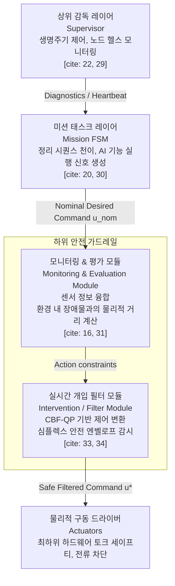
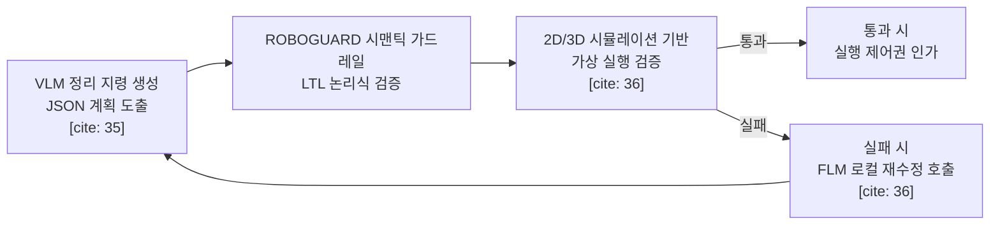

# AI 기반 독서실 정리 로봇을 위한 다계층 안전 검증 및 상태머신 아키텍처 설계

## 서론: 비정형 독서실 환경에서의 AI 매니퓰레이션과 안전성 도전 과제

독서실 책상과 같이 한정된 공간 내에서 책, 공책, 학용품, 지우개 가루 등의 이종(Heterogeneous) 객체를 분류하고 정돈하는 매니퓰레이션 작업은 고도의 물리적·인지적 유연성을 요구한다.

이러한 비정형 환경에 대응하기 위해 최신 로봇 공학계는 시각-언어 모델(Vision-Language Model, VLM) 기반의 고수준 태스크 플래닝과 강화학습(Reinforcement Learning, RL) 및 모방학습(Imitation Learning, IL) 기반의 저수준 스킬 제어기를 결합하는 인공지능 프레임워크를 도입하고 있다.

그러나 신경망 기반의 인공지능 제어 기술은 불확실한 실세계 환경에서 치명적인 실패 원인을 내포한다. VLM은 물리적 제약 조건을 오인하여 실현 불가능하거나 위험한 궤적을 명령하는 환각 현상(Hallucination)을 보일 수 있고, RL/IL 정책은 학습 분포를 벗어난 예외 상황(Out-of-Distribution)에 직면했을 때 과도한 관절 제어 신호를 출력하여 독서실 가구 파손이나 인간 사용자와의 충돌을 유발할 수 있다. 더욱이 250~700ms에 달하는 거대 모델의 추론 지연 시간(Latency)은 1~10ms 수준의 실시간 제어 스레드와 심각한 시간적 비동기성을 초래한다.

이러한 문제를 해결하기 위해 시스템의 안정성을 보장할 안전 검증(Safety Check) 시스템의 설계가 필수적이다.

본 설계 보고서는 독서실 정리 로봇을 위한 안전 검증의 시간적 주기 분류, 미션 제어 유한 상태머신(Finite State Machine, FSM)과 안전 가드레일 계층 간의 아키텍처적 배치 최적화, 그리고 AI 기술별 특화된 안전 필터 연계 방안을 시스템 아키텍처 관점에서 제시한다.

## 안전 검증의 시간적 주기 설계: 수시 검증과 특정 시점 검증의 결합

안전 검증은 단일 주기로 설계될 경우 연산 자원 낭비나 반응 지연을 유발하므로, 발생할 수 있는 위험의 물리적 특성에 따라 실시간으로 동작하는 수시 검증(Continuous Checking)과 특정 전이 조건에서 기동하는 특정 시점 검증(Epoch-based/Event-driven Checking)의 이중 트랙으로 이원화해야 한다.

### 수시(실시간) 검증의 범위와 한계

수시 검증은 주로 제어 및 물리 계층에서 실시간(100Hz~1kHz 이상)으로 수행되어야 한다. 로봇 팔이 독서실 책상 칸막이나 전등, 필기구 스탠드 등 장애물에 접근하는 충돌 경로 모니터링, 과전류 및 관절 한계각(Joint limits) 초과, 비상 정지(E-Stop) 입력 상태 체크 등은 지연 없이 연속적으로 모니터링되어야 한다.

만약 이러한 수시 검증이 미션 상태머신의 루프 주기 수준(예: 10~30Hz)으로 지연될 경우, 속도가 높은 매니퓰레이터 팁이 제동 거리를 확보하지 못해 하드웨어 충돌을 막을 수 없게 된다.

### 특정 시점(이벤트 기반) 검증의 효율성

비실시간성 논리나 고차원 시맨틱 인식 영역은 특정 시점에 수행하는 것이 타당하다. VLM이 생성한 정리 계획의 논리적 모순성 검토(예: 필통을 닫기 전에 펜을 먼저 넣어야 하는 시퀀스 유효성)는 태스크 계획 수립 직후 단 한 번만 검증하는 계획 합성(Planning/Synthesis) 단계에서 수행된다.

또한, 물체를 안정적으로 쥐었는지 판별하는 그리퍼 압력 값 분석 및 시각적 파지 완료 검증은 스킬 제어기가 GRASP 행동을 완료하고 상태가 천이되는 특정 이벤트 바운더리(Transition point)에서만 집중 검증하도록 분리 설계해야 시스템 전체의 불필요한 연산 부하를 제어할 수 있다.

아래의 비교 매트릭스는 독서실 정리 로봇 시스템 내에 분할 탑재되어야 할 안전 검증의 시간적·기하학적 범주와 구체적 검증 항목을 나타낸다.

| 검증 주기 구분 | 대상 제어 도메인 | 주요 검증 항목 (실제 적용 사례) | 권장 실행 주파수 / 시점 | 연산 오버헤드 및 우선순위 |
|---|---|---|---|---|
| 수시 검증 (Continuous) | 제어 및 구동 계층 | 관절 토크 마진 위반 여부 감시<br>작업 공간(Workspace) 범위 내 장애물 충돌<br>소프트 액추에이터 과열 모니터링 | 100 Hz ~ 1,000 Hz | 낮음 (단순 수학적 한계 비교)<br>최상위 물리 우선순위 |
| 특정 시점 검증 (Epoch-based) | 미션 및 논리 계층 | 정리 대상 객체의 기하학적 vertex 추정 오류<br>정리 계획의 선·후수 순서 위반 (LTL 사양 부합 여부)<br>그리퍼 압착 성공 유무 확인 | 태스크 계획 기동 직후<br>스킬 상태 천이 시점 | 보통 ~ 높음 (시각 처리/LTL 해석 필요)<br>보통의 시퀀스 제어 우선순위 |
| 장기적 보정 검증 (Long-term) | 자가 진단 및 헬스 | ROS 2 노드 간 통신 대역폭 및 패킷 드롭<br>시간 동기화 오차 감시 (Clock Drift)<br>카메라 렌즈 내 시각적 가림 감지 | 1 Hz ~ 5 Hz | 매우 낮음 (백그라운드 통계 분석)<br>시스템 지속성 우선순위 |

## 안전 아키텍처 배치 전략: FSM 내부 vs 상위 레이어 vs 하위 필터

안전 검증 로직의 시스템 통합 설계 시, 이를 탑재할 레이어의 선택은 아키텍처적 트레이드오프(Trade-off)를 수반한다. 본 설계는 상위 태스크 모니터링 레이어 - 미션 FSM - 하위 제어 필터(Intervention Layer)가 결합된 다계층 방어(Defense-in-Depth) 구조를 제안한다.

### FSM 내부 탑재 방식의 한계

수시로 동작해야 하는 물리적 충돌 감지 및 비상 제어 로직을 FSM의 개별 상태 내부나 가드(Guard) 조건에 직접 매립하는 구조는 안티 패턴으로 이어진다.

실시간 예외 처리를 FSM 내부에 구현할 경우, 모든 개별 상태(예: DETECTING, GRASPING, PLACING)에서 에러 대응 상태인 ERROR나 EMERGENCY_STOP으로 탈출하기 위한 전이(Transition) 선이 기하급수적으로 추가되어 가독성을 심각하게 해치는 스파게티 전이선 문제를 일으키며, 상태 머신의 독립적인 코드 재사용을 불가능하게 만든다.

### FSM 상위 레이어(Supervisory Layer) 배치의 한계

상위 레이어는 시스템 진단 및 노드 생명주기 관리(ROS 2 Lifecycle Managed Nodes)에 매우 적합하다. 그러나 상위 레이어를 실시간 안전 검증 제어의 통로로 삼을 경우 미들웨어 통신 지연(DDS 통신 지연 및 운영체제 스케줄러 지터)으로 인해 실시간 제어 스레드와의 동기적 안전을 제공하지 못한다.

상위 레이어의 느린 응답 특성 때문에 1~10ms의 순간적인 물리 사고 위협을 감지하더라도 액추에이터 전원 차단 명령이 로봇에 늦게 도착할 위험이 존재한다.

### 해결책: 다계층 안전 가드레일 (Modular Safety Guardrails) 아키텍처

이를 극복하기 위해 제안하는 최적의 아키텍처 패턴은 태스크 실행 레이어인 FSM은 높은 수준의 상태 관리(예: "현재 무슨 책을 정리하는가")에 집중하게 하고, 제어 지령을 가로채 실시간으로 거르는 하위 필터 계층을 물리 서보 제어기 직전에 장착하는 구조이다.

이 구조는 고수준의 '느린 생각(Slow Thinking, 250-700ms)'과 하위의 '빠른 생각(Fast Thinking, 1-10ms)'을 완전히 격리하면서도 정보의 일관성을 유지하게 한다.



이 다계층 아키텍처의 구체적인 제어 정보 흐름 및 설계 세부 사항은 다음과 같다.

### 표현 정렬(Representation Alignment) 기반 데이터 전달

하위 모니터링 레이어는 미션 레이어에 단순히 '안전/위험'과 같은 이진 스칼라 신호를 보내지 않고, 3D 공간 상의 타원형 자세 불확실성(Ellipsoidal Pose Uncertainty)이나 점유 공간 튜브(Occupancy Tubes) 형태의 저손실 다차원 시맨틱 공간 필드를 그대로 실시간 전달하여 간섭의 왜곡을 최소화한다.

### 보수성 할당(Conservatism Allocation) 제어

상호 작용하는 결정 기동 게이트(Decision Gate)와 행동 수정 게이트(Action Gate)가 각자 독자적으로 보수적 매개변수를 적용하여 과도한 시스템 멈춤(Deadlock)이 발생하는 것을 방지하기 위해, 하위 개입 모듈이 물리적 여유 마진을 충분히 통제할 수 있다고 판단할 시 FSM의 결정 기동 게이트는 승인 기준을 일시 완화하는 등 두 게이트 간의 긴밀한 아키텍처적 조율이 이루어진다.

## AI 기술별 특화된 안전 가드레일 연계 설계

각각의 미션 FSM 상태에서는 독립적인 인공지능 요소 기술(VLM, RL, IL)이 구동되며, 해당 신경망들의 독자적 불안정성을 극복하기 위한 맞춤형 안전 연계 구조가 요구된다.

### 1. 고수준 태스크 플래닝 상태(VLM)에서의 안전 가드레일 (ROBOGUARD 연계)

책상의 상태를 판별하여 정리 작업을 지시하는 VLM 구동 상태(STATE_VLM_PLANNING)에서는 모델의 비결정적 출력(비합리적 행동 순서, 깨지기 쉬운 물건에 무거운 물건 적치 지령 등)을 원천 차단하기 위한 시맨틱 안전 쉴드가 필요하다.

VLM이 독서실 환경을 RGB-D 이미지로 취득해 JSON 형태의 태스크 계획을 도출하면, 이 지령은 실행 전 ROBOGUARD 가드레일의 '비선형 문맥 정렬 가드(Contextual Grounding Module)'를 통과해야 한다.

ROBOGUARD는 오프라인에서 정의된 고정 안전 규범(예: "액체가 담긴 컵은 10cm 이상 들어 올리지 말 것", "날카로운 필기구는 그리퍼 끝 방향으로 쥐지 말 것")을 신뢰할 수 있는 루트-오브-트러스트(Root-of-trust) 소형 언어 모델을 통해 선형 시제 논리(Linear Temporal Logic, LTL) 규격식으로 변환한다.

이후 해당 시방서 조건에 VLM의 JSON 계획이 유효한지 검증하고 불합격 시에는 태스크 FSM에 실패 이벤트를 전파하여 즉각적인 로컬 수정 루프(Bounded Local Repair Loop)를 8회 이내로 호출하게 설계한다.



추가적으로, 물리적인 정리 지령을 직접 로봇팔 기하 구조에 정렬하기 위해, 물체 조작이 종료된 후 그리퍼를 고의적으로 천장 카메라 방향으로 들어 올리는 '결과 증명 단계(Inspection Phase)'를 배치하여 VLM이 이미지 비교를 통해 직접 파지 성공 유무를 교차 검증하고 메모리 버퍼를 업데이트하도록 흐름을 제어한다.

### 2. 저수준 스킬 제어 상태(RL 및 IL)에서의 실시간 안전 가드레일 (CBF-RL 및 심플렉스 연계)

독서실의 실제 문구류를 파지하고 적절한 바구니로 운반하는 등 빠른 동역학이 지배하는 상태(STATE_RL_CONTROL)에서는 제어 배리어 함수(Control Barrier Function, CBF)와 심플렉스 아키텍처(Simplex Architecture)가 안전을 견인한다.

전형적인 강화학습(RL) 정책은 고성능의 궤적을 그리려 하다가 안전 한계를 과감하게 이탈하는 경향이 있으며, 단순 에피소드 조기 종료(Episode termination)식 학습법은 로봇팔의 자멸적 제동 성능 저하를 방지하기 어렵다.

따라서 학습 단계에서부터 실제 장비 손상을 막기 위해 CBF-RL 프레임워크를 탑재해야 한다. CBF-RL은 신경망 출력 단에 정형 수학적 CBF 필터를 통과시킴과 동시에 배리어 침범 강도에 가중치를 둔 연속 페널티(Barrier-inspired continuous negative reward)를 보상 함수에 녹임으로써, 배타적 학습 중 강제 충돌 상황을 사전에 예방하고 학습 성능을 보강하여 실제 배포 단계에서 무리한 신호 보정이 발생하지 않도록 제어 정책의 '안전 내재화'를 끌어낸다.

배포 환경에서의 엄격한 안전 구속 조건을 가동하기 위하여, 제어 주기마다 공칭 제어 출력 $u_{nom}$을 2차 계획법 최적화(CBF-QP) 제어기에서 여과한다. 예기치 못한 비선형 모멘텀이나 외란으로 로봇 팔 제어 상태 $x$가 사전에 지정된 안전 외포막 범위를 완전히 벗어나는 순간, 시스템의 심플렉스 결정 모듈(Decision Module, DM)은 불안전한 비선형 정책을 차단하고, 수치 검증된 고안전 수동 계획 제어기(High-Assurance Controller, HAC)로 즉각 교체 기동한다.

```math
x \notin \mathcal{S}_{sem} \implies \text{Active Control Authority} \leftarrow \text{HAC (Emergency Brake/Safe Pullback)}
```

## 독서실 책상 정리 매니퓰레이션에의 실무적 적용

독서실 책상 상판은 좁은 공간 내에 다양한 형상 및 마찰계수를 지닌 다종의 학용품이 널려 있어 이종 물체에 맞는 정교한 조작 스킬과 특화 제약조건 감시가 필수적이다.

### 물체 성상에 따른 기하학적 키포인트 추출 및 제어 프리미티브

로봇의 인지 파이프라인(Perception pipeline)은 책상 위 물체를 세밀하게 검출하여 그 형상에 특화된 조작을 가한다.

#### 소형 강체 물체

대상 예시:

- 지우개
- 펜
- 샤프심 통 등

지점 형상 및 질량 중심을 직접 추정하여 중심 기반 다이렉트 파지 프리미티브(Direct Grasping)를 취한다. 이때 그리퍼 끝단의 과도한 파지력이 귀중품 볼펜의 몸체를 파손시키지 않도록 하드웨어적인 토크 제한(Torque limits)과 접촉 압력 검증 가드를 실시간 수행한다.

#### 평면 강체 물체

대상 예시:

- 자
- 삼각자
- 평평한 소품 등

얇고 평평한 형상은 직접 움켜쥐기 힘드므로 기하학적 다각형近似(Polygon approximation)와 Convex hull 검출 기법을 사용하여 외각 점들을 검출한 뒤, 물체를 상판 가장자리 구석으로 밀어서 그리퍼 공간을 수직 확보하는 가장자리 밀기 프리미티브(Edge-based Push-Grasping)를 적용한다.

이 상태에서는 상판 모서리를 탈출하여 물체가 바닥으로 낙하하는 사고를 제어 배리어 범위($h_{edge} \ge 0$)로 구속 검증한다.

#### 변형 가능 평면 물체

대상 예시:

- 공책
- 낱장 종이
- 책 등

강체로 다룰 수 없으므로 제한된 변형 계수(Deformability)를 활용해 살짝 긁어 틈을 만드는 지렛대 방식 프리미티브(Levering-based Grasping)를 구사한다.

과도한 구부림으로 종이가 찢어지거나 구겨지는 일을 막기 위해, 힘-토크 센서(F/T Sensor) 피드백 값의 미분 값이 일정 임계치를 추월하는 경우 동작을 즉각 중지하는 연속성 안전 조건(Liveness Gating)을 통과하도록 제어한다.

### 정리 효율성 극대화를 위한 다이내믹 버퍼(Dynamic Buffer) 활용

여러 물건을 일일이 바구니로 왕복 운송하는 비효율을 방지하기 위해 물건들을 일시적으로 포개어 한꺼번에 이송하는 다이내믹 버퍼(Dynamic Buffer) 전략을 가동한다.

이 기법은 정리 공간 내에 '이동식 간이 적치 타워'를 가상 구축하는 것과 같아서 로봇 팔의 총 작동 경로 길이를 크게 감소시킨다. 그러나 높게 쌓인 다단 물체 타워의 물리적 무게 균형은 무너지기 쉽기 때문에, 가속 시 각 관절 관성 변화율 및 자이로 감도를 추적하여 질량 중심 이탈 조건 위험 한계가 수시 검증되면 로봇 팔 운반 속도를 0.1m/s 이하로 강제 감속(Speed and Force Limiting)하도록 동역학적 범위를 엄밀히 통제한다.

## 미션 FSM과 하위 안전 계층 간의 메시지/이벤트 설계

안전 아키텍처는 최종적으로 결정론적인 계층적 유한 상태머신(HFSM) 내부에서 각 상태가 서로 충돌을 빚지 않고 유기적으로 연결되도록 구현되어야 한다.

### 상위 상태머신의 거시적 상태 설계

상위 아키텍처는 전체 생명주기를 주관하는 대형 상태머신을 포함한다.

- `SYSTEM_IDLE`: 동작 정지 상태이며 태스크 대기.
- `ACTIVE_OPERATION`: 활성화 조작 구역으로, 자식 FSM(Child FSM)을 구동하는 합성 상태(Composite State).
- `SAFE_RECOVERY`: 안전 검증 필터에 의해 실시간 이관 처리가 수행되었을 때 안전하게 진입하여 오류를 국소 치유하는 복구 공간.
- `CRITICAL_ERROR`: 심각한 모터 잠김 또는 통신 불능 시 기계를 영구 정지시키고 인가 전원을 차단하는 안전 등급 Category 0의 긴급 락 아웃 상태.

### 예외 이관 메시지 연동 메커니즘 (Message/Event Bubble-up)

FSM 내부의 각 동작 상태에서 발생하는 심각한 물리 안전 위협에 유연히 대처하기 위해 부모-자식 상태 간의 이벤트 버블업(Bubble-up) 기법을 아키텍처상 정의한다.

ACTIVE_OPERATION 상태 내부의 자식 상태머신에서 RL 제어기가 필기구를 치우는 중, 하부 안전 필터 계층(CBF-QP)의 연산 실패 혹은 심플렉스 외포막 이탈 상태가 도출되면, 즉시 물리 통신망을 통해 전역 이벤트인 SAFETY_INTERVENTION 신호가 생성된다.

이 이벤트는 하부 자식 상태머신 자체에서 처리하지 않고 부모 상태인 ACTIVE_OPERATION 레이어로 상향 전파(Bubbled up)되어 기동 중인 모든 AI 제어 서브루프를 소멸(Destroy exit action 실행)시킨 뒤, 안전하게 제어권을 수동 제어 모드로 회귀시킨 다음 SAFE_RECOVERY 상태로 부드러운 상태 천이를 감행한다.

## 활성 상태(ACTIVE_OPERATION) 내 비결정론적 태스크 처리를 위한 행위 트리(Behavior Tree) 통합

거시적 모드 전환은 상태 일반화와 엄격한 결정성을 제공하는 FSM(HFSM) 구조가 단연 우수하지만, 수많은 변형과 물리적 외란이 지속해서 발생하는 독서실 책상 정리 시나리오를 FSM만으로 표현하려면 수십 개의 전환 분기가 추가되어 효율성이 퇴색된다.

따라서 ACTIVE_OPERATION 합성 상태 내부의 정밀 구동 시퀀스 단계에서는 행위 트리(Behavior Tree, BT)를 '액팅 엔진(Acting Engine)'으로 혼합 구성하는 하이브리드 아키텍처를 적용하는 것이 가장 이상적이다.

행위 트리는 깊이 우선 탐색(Pre-order Traversal) 방식으로 매 틱(Tick)마다 트리 전 영역의 전제 조건을 재평가(Re-evaluation)하므로, 정리 작업 수행 도중 뜻밖의 인간 손이 난입하거나 필기구가 미끄러지는 외란에 대응하여 상태 전환 로직 수정 없이 즉각 다른 가지(Branch)의 회피 행동이나 파지 복구 행동으로 기동성을 발휘할 수 있게 해준다.

아래의 설계 비교는 작업 스위칭을 주도하는 FSM 방식과 하이브리드 행위 트리 방식의 공학적 차별성을 상세 규정한다.

| 아키텍처 특성 요소 | 단일 평면 Finite State Machine (FSM) | 계층적 상태머신 (HFSM) | 제안 아키텍처: HFSM (Macro-mode) + Behavior Tree (Task Control) |
|---|---|---|---|
| 시스템 복잡도 제어 능력 (Complexity Control) | 낮음. 상태가 미세 추가될 때마다 전이 화살표가 $O(N^2)$ 비율로 증가 | 보통. 부모 상태 추상화를 통해 로직 구조를 상당히 격리 가능 | 극도로 우수. 거시 계통은 HFSM이 담당하고 미시 정리 행동은 BT로 완벽 격리 |
| 비결정론적 예외 대처 속도 (Reactivity) | 나쁨. 전용 예외 처리 천이 조건이 만족하기 전까지 다른 작업 선점 불가 | 보통. 부모 레벨로 이벤트 전파 시 다단계 전단 과정을 거쳐 일부 지연 발생 | 매우 빠름. BT의 상위 Sequence/Fallback 노드가 실시간 가드 조건을 가로챔 |
| 스킬 노드의 이식 및 재사용성 (Modularity) | 나쁨. 각 상태가 이전/이후 상태 정보를 내부 전이 코드에 정적으로 하드코딩함 | 보통. 자식 상태머신 단위로 라이브러리화하여 특정 FSM에 간접 이식 가능 | 극도로 우수. BT의 모든 행동/조건 리프 노드는 일관된 인터페이스를 지닌 pure function임 |
| 수치 검증성 및 정적 분석 편리성 | 보통. 상태 전이 표 작성이 용이하나 시스템 확장 시 매트릭스가 붕괴됨 | 우수. 상위 다이어그램 가시성이 높아 형식 정적 검증 도구 적용성 높음 | 매우 우수. 정형 문법 규칙을 따르므로 LLM 자동 생성 및 안전성 정적 증명에 매우 용이 |

## 결론: 안전한 독서실 책상 정리 로봇 시스템 설계안 종합 및 제안

AI 기반 독서실 책상 정리 로봇의 안전하고 강인한 동작을 구현하기 위해, 시스템 설계자는 아래의 통합 설계 아키텍처 규격을 준수하여 하드웨어 및 소프트웨어를 구현해야 한다.

### 시간적 안전 경계 설계

관절 가속도, 충돌 방지 제어 등 하위 물리 영역은 1kHz 단위로 수시(실시간) 검증하며, VLM 시퀀스 적합성 및 그리퍼 검증 등 인지 영역은 상태 전이 시점에 맞춰 특정 시점(이벤트 기반) 검증으로 수행한다.

### 다계층 안전 가드레일 배치

고수준 FSM에 무리한 안전 이탈 상태선을 우겨넣지 말고, FSM과 실시간 하드웨어 구동기 사이에 독립된 '안전 개입 필터 계층'을 탑재하여 관심사를 철저히 분리한다.

### AI 기술과의 안전 연계

#### VLM

계획 도출 단계에서 시맨틱 오작동 방지용 LTL 사양 검증기(ROBOGUARD)를 통과하게 하며, 동작 완료 후 Overhead 카메라에 그리퍼 영역을 투영하는 visual 확인 단계를 구축한다.

#### RL/IL

제어 한계의 무작위성 방지를 위해 설계 단계에서 CBF-RL 방식을 도입하여 주행 정책 내에 인라인 안전을 내장화하고, 런타임에는 1kHz의 OSCBF 필터 및 심플렉스 안전 엔벨로프 감시 모듈을 적용한다.

### 책상 정리 시나리오 최적화

얇은 자나 공책 같은 변형 물체를 책상 모서리로 밀어 처리하는 가장자리 밀기 조작 프리미티브와 공간을 확보하기 위한 다이내믹 버퍼 적치 운송 모드를 접목하고, 이에 대응하는 물리적 가속 제한 및 마찰 한계를 안전 필터 제약 조건에 연동한다.

### 하이브리드 미션 제어

안정적인 거시 모드 제어는 계층적 상태머신(HFSM)을 통해 구현하되, 실시간 변형 대응이 필수적인 ACTIVE_OPERATION 상태의 내부 세부 스킬 호출 제어 영역은 행위 트리(Behavior Tree)에 위임하는 하이브리드 아키텍처를 확립한다.
